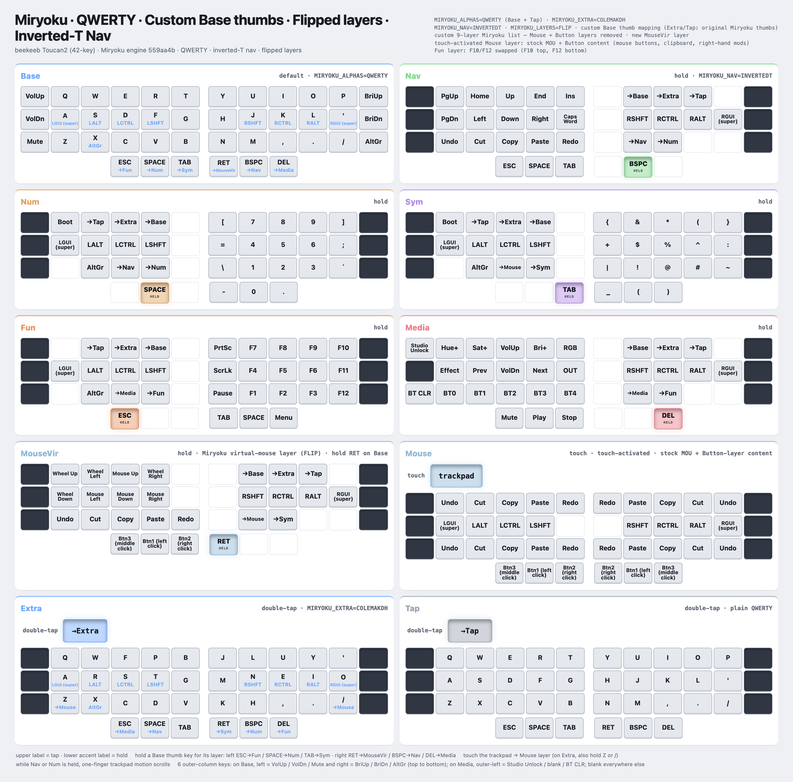

# ZMK config for beekeeb Toucan2 Keyboard: Miryoku edition

[The beekeeb Toucan2 Keyboard](https://beekeeb.com/introducing-toucan2/) is a wireless split 42-key column‑stagger keyboard with a display and a trackpad, with an aggressive stagger on the pinky columns.

This fork runs a custom interpretation of [Miryoku](https://github.com/manna-harbour/miryoku) on it, as a gradual step toward a 36-key layout. The Miryoku core uses the inner 5 columns and 3 thumb keys per hand. The 6 outer-column keys are only mapped on Base (plus two on Media), so they can be weaned off one at a time.

<picture>
  <source media="(prefers-color-scheme: dark)" srcset="docs/keymap-dark.png">
  
</picture>

The source for the diagram is [docs/keymap.html](docs/keymap.html). It is a standalone page, so you can download it and open it in a browser. It follows your light or dark theme.

## Layout

- **Alphas:** QWERTY on Base and Tap, Colemak-DH on Extra (`MIRYOKU_ALPHAS=QWERTY`, `MIRYOKU_TAP=QWERTY`, `MIRYOKU_EXTRA=COLEMAKDH`).
- **Navigation:** inverted-T arrows, with layers flipped so Nav, Media, Num, Sym and Fun content sits on the opposite hand from stock (`MIRYOKU_NAV=INVERTEDT`, `MIRYOKU_LAYERS=FLIP`).
- **Base thumbs:** taps are ESC / SPACE / TAB and RET / BSPC / DEL. Holds are custom: left ESC→Fun, SPACE→Num, TAB→Sym; right RET→MouseVir, BSPC→Nav, DEL→Media. Extra and Tap keep the original Miryoku thumb holds.
- **Home-row mods:** GACS (pinky→index), mirrored. The flavor is `balanced` with a 250 ms tapping term, 175 ms quick-tap and 150 ms require-prior-idle. Holds use opposite-hand triggers with `hold-trigger-on-release`, so same-hand rolls don't misfire mods.
- **Outer column:** on Base, left = VolUp / VolDn / Mute and right = BriUp / BriDn / AltGr. On Media, outer-left = Studio Unlock / blank / BT CLR. Blank everywhere else.
- **Layers** (keymap index order): Base, Extra, Tap, Nav, Media, Num, Sym, Fun, MouseVir, Mouse.
  - **MouseVir** is Miryoku's keyboard-driven mouse (movement, wheel, buttons). Hold RET to reach it.
  - **Mouse** is the touch-activated layer, described below. It replaces Miryoku's Button layer.
- **Other tweaks:**
  - Fun has F10 and F12 swapped, so the F10/F11/F12 column reads top to bottom.
  - Media has an output toggle (USB/BLE) where stock Miryoku has the external-power toggle.

## Trackpad

- **Touch** the trackpad to hold the **Mouse** layer: mouse buttons on the thumbs, clipboard on the top and bottom rows, and plain mods on the home row. On the Extra layer, holding Z or `/` reaches the same layer without touching the pad.
- **Scroll:** while **Nav** (hold BSPC) or **Num** (hold SPACE) is held, one-finger motion scrolls. Two-finger scrolling works anywhere (TPS43 native).
- **Gestures** (macOS shortcuts by default; define `TOUCAN_WIN_MODE` in [toucan.dtsi](boards/shields/toucan/toucan.dtsi) for Windows):
  - pinch zooms (Cmd -/=);
  - three-finger swipes send Ctrl+Cmd+arrow (up, right, down, left), for binding to Spaces or window managers.

## Repository layout

| Path | What |
| --- | --- |
| [config/toucan.keymap](config/toucan.keymap) | Keymap entry point: includes the Miryoku engine and adds the home-row mod behaviors, the touch Mouse layer and the trackpad overrides |
| [config/miryoku/custom_config.h](config/miryoku/custom_config.h) | Miryoku options, custom layer list, and per-layer overrides |
| [config/miryoku/mapping/42/toucan2.h](config/miryoku/mapping/42/toucan2.h) | 42-key Toucan2 board mapping (Miryoku 36-key core + 6 per-layer outer keys) |
| `config/miryoku/` (everything else) | Miryoku ZMK engine, vendored unmodified from [manna-harbour/miryoku_zmk@559aa4b](https://github.com/manna-harbour/miryoku_zmk/tree/559aa4beae75cb3206ab411b7da2adb9665c6896) |
| `boards/shields/` | Toucan2 shield and nice_view_gem display, tracked from [beekeeb/zmk-keyboard-toucan2](https://github.com/beekeeb/zmk-keyboard-toucan2) |

Other upstream customization points:

- **General configs**: [boards/shields/toucan/toucan_left.conf](boards/shields/toucan/toucan_left.conf) and [boards/shields/toucan/toucan_right.conf](boards/shields/toucan/toucan_right.conf)
- **Swipe shortcuts**: the `swipe_button_mapper` node in [boards/shields/toucan/toucan.dtsi](boards/shields/toucan/toucan.dtsi)
- **Invert scroll / trackpad settings**: the `tps43_trackpad` node in [boards/shields/toucan/toucan_right.overlay](boards/shields/toucan/toucan_right.overlay)
- **Status screen style**: `CONFIG_TOUCAN_STATUS_SCREEN` (0-2) in [toucan_left.conf](boards/shields/toucan/toucan_left.conf)

## Build and flash

Every push builds firmware with GitHub Actions ([build.yaml](build.yaml)). It produces three UF2 files: the left half (with ZMK Studio), the right half, and `settings_reset`. Download them from the run's artifacts.

To flash one half: connect it over USB and **double-tap RST** on the XIAO. A drive named XIAO mounts. Drag the matching UF2 onto it.

1. If you're coming from a different keymap, flash `settings_reset` to both halves first. The layer list changed, and settings stored by ZMK Studio would otherwise shadow the new keymap.
2. Flash the **left** half, then the **right** half.

Full guide: <https://docs.beekeeb.com/toucan-keyboard/quick-start-keymap-and-firmware>

# License

The code in this repo is available under the MIT license.

The vendored Miryoku ZMK engine under `config/miryoku/` is by Manna Harbour (https://github.com/manna-harbour/miryoku_zmk). Only `custom_config.h` and `mapping/42/toucan2.h` there are specific to this repo.

The included shield nice_view_gem is modified from https://github.com/M165437/nice-view-gem licensed under the MIT License.

The linked trackpad module is based on https://github.com/geeksville/zmk_driver_azoteq

ZMK code snippets are taken from the ZMK documentation under the MIT license.

The embedded font QuinqueFive is designed by GGBotNet, licensed under the SIL Open Font License, Version 1.1.
